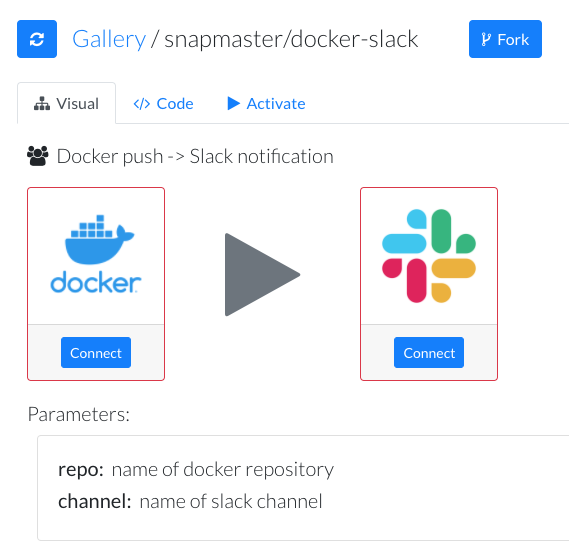
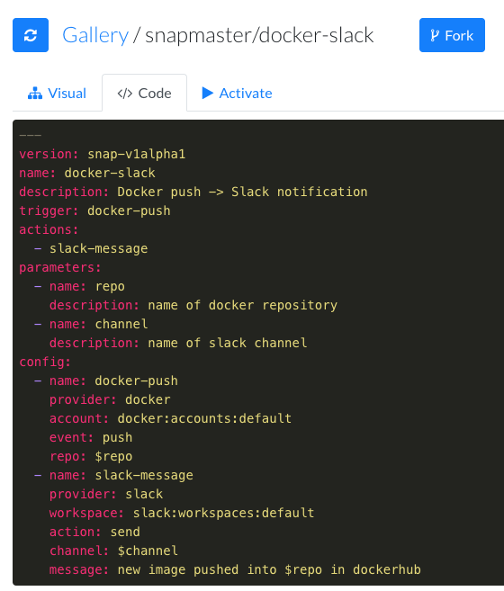

# Introduction

SnapMaster is a tool and framework for creating and running event-driven workflows.

## Snaps

*Snaps* are workflows that are activated on an event.  Snaps have a *trigger* and a set of 
*actions* that are invoked when the trigger is fired.

Snaps are YAML documents.  They are named using an {account}/{name} format.  The 
`snapmaster` account contains a number of "starter" snaps - for example, 
`snapmaster/docker-slack`.  The *Gallery* contains a number of public snaps, including 
`snapmaster/docker-slack`, which has the following graphical representation:

The `snapmaster/docker-slack` snap has the following YAML representation:

## Parameters

Besides the trigger and actions, a snap can define *parameters*.  These are passed 
into the snap when it is *activated*, and make the snap reusable.  The 
`snapmaster/docker-slack` snap takes two parameters - the name of the docker repo, and 
the name of the slack channel.

## Config

The *config* section ties together the triggers and actions with their required arguments, 
and binds the input parameters into these arguments.  A trigger will have an *event* that 
it is fired on, and an action will have an *action* that it will perform.

In the `snapmaster/docker-slack` example, the trigger is named `docker-push`, is provided 
by the `docker` provider, takes the default account, is fired on the `push` event, and 
takes its `repo` argument from the `$repo` parameter that was passed in.

Similarly, the `slack-message` action is provided by the `slack` provider, takes the 
default workspace, uses the `send` action, takes the `channel` argument from the `$channel`
parameter passed in, and also parameterizes the `message` argument using the `$repo` 
parameter.

See the [snap reference](../snap-reference/snap-reference) for a complete description of 
the snap definition language.

## Tools

Tools are a collection point for *triggers*, *actions* and a place to store *credentials*.

Tools are also described using a YAML specification. For example, the `pagerduty` tool 
exposes both a trigger called `incident` which fires when a new PagerDuty incident is 
created, as well as an action called `create` which will create a new incident.

## Activating Snaps

Once all of the tools that a snap references are connected, a snap can be *activated*. This will create the webhook corresponding to the trigger, and when that webhook fires, 
the actions will be executed sequentially.

## Next steps

Login to SnapMaster and activate your first snap!
